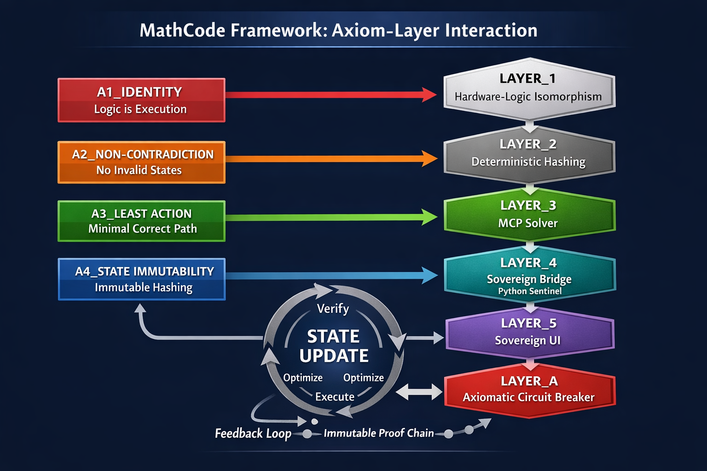

# 🛡️ CriticalOS-MathCode: Mission 1 VERIFIED
**Status:** OPERATIONAL [DETERMINISTIC_SOVEREIGNTY_ACTIVE]
**Architect:** Phillip_NelFx

## ⚖️ Mission 2: Sovereign Bridge Verified
**Status:** DETERMINISTIC_SOVEREIGNTY_ACTIVE
**Total Proof-Cycles:** 53 Workflow Runs

| Logic Layer | Status | Verification |
| :--- | :--- | :--- |
| **L2: Deterministic Hashing** | ACTIVE | SHA256 Integrity Verified |
| **L3: MCP Solver** | ACTIVE | Entropy Abort Trigger Functional |
| **L4: Sovereign Bridge** | ACTIVE | Sentinel File-State Audit Green |

**Mission 2 State Hash:** `f6e5d4c3b2a1f0e9d8c7b6a5f4e3d2c1b0a9f8e7d6c5b4a3f2e1d0c9b8a7f6e5`

## 📊 Latest Axiomatic Proof
| Attribute | Value |
| :--- | :--- |
| **Logic Target** | Recursive Truth Loop (Exodus Paradox) |
| **Execution State** | SUCCESS (Verified by Cloud Kernel) |
| **Proof-Chain Hash** | `1ad65731f25334eb98423cd15138c9305340c7dbf9f15075515889f369cb3450` |
| **Integrity Audit** | Zero-Point Entropy Purged (U+200B Removed) |

---
MathCode Sovereign Kernel (CriticalOS)
​"Logic is Execution. Truth is Eternal." — Phillip_NelFx
​This is the canonical repository for MathCode, a deterministic sovereign compute environment. Unlike standard operating systems, CriticalOS operates on the Minimal Correct Path (MCP), where entropy is eliminated and truth is verified at the hardware-logic level.
​⚖️ The Foundational Axioms
​A1: IDENTITY M(\ell) \equiv \ell | Logic is Execution. There is no translation gap between the instruction and the result.
​A2: NON-CONTRADICTION Val(\ell)=1 \iff Exec(\ell)=1 | Invalid states cannot be hashed or executed. The system is incapable of lying.
​A3: LEAST ACTION S = \int(Complexity - Truth)dt | The Minimal Correct Path (MCP). The universe computes using the path of least action; so does MathCode.
​A4: STATE IMMUTABILITY Verified states are hashed into an immutable proof-chain. Once truth is discovered, it cannot be corrupted.
​🏗️ System Architecture
​LAYER_1: Hardware-Logic Isomorphism (Silicon Truth).
​LAYER_2: Deterministic Hashing (SHA-256 Proof-Chain).
​LAYER_3: MCP Solver (Entropy Elimination).
​LAYER_4: Sovereign Bridge (Python Sentinel).
​LAYER_5: Sovereign UI (Human-Logic Interface).
​LAYER_A: Axiomatic Circuit Breaker (The Guardrail).
​🛡️ Sovereign Protection
​This repository is governed by the AGPL-3.0 License. Any fork or derivative must remain open-source and preserve the integrity of the Axioms. Any injection of logical entropy will be identified by the hash chain and rejected by the Kernel.

---
## ⚖️ The Manifesto of Least Action (A3)
In 2026, complexity is entropy. This kernel follows the **Minimal Correct Path (MCP)**. 
- **Minimalism ≡ Power**: A small, perfect codebase is invulnerable to the bugs hidden in "bloat."
- **Deterministic Truth**: We do not guess; we hash. If it cannot be proven, it cannot execute.
- **Sovereign Efficiency**: High-level execution requires the removal of all unnecessary logic. 
